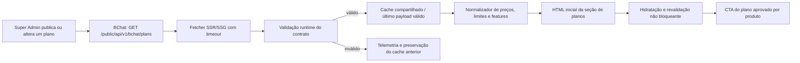

# Plano técnico e funcional — landing page pública do BChat Copilot

**Status:** planejamento, sem implementação  
**Destino da implementação:** outro projeto frontend  
**Fonte de dados comerciais:** BChat, API pública de planos  
**Data da investigação:** 2026-08-04  
**Idioma da interface:** português do Brasil (`pt-BR`)

## 1. Resumo executivo

A landing page deve apresentar o BChat Copilot como uma solução SaaS de atendimento assistido por inteligência artificial, explicar capacidades confirmadas no produto, permitir a comparação dos planos publicados e encaminhar o visitante para o fluxo comercial que o produto aprovar.

A recomendação arquitetural é usar **SSR ou SSG com revalidação**, mantendo o conteúdo principal e os planos no HTML inicial. A aplicação deve buscar os planos no servidor em `GET /public/api/v1/bchat/plans`, manter cache curto com estratégia stale-while-revalidate e fazer revalidação não bloqueante no cliente quando a atualização imediata for relevante. SSG apenas no momento do build não atende ao requisito de atualizar planos sem novo deploy.

As rotas sob `/super_admin` não devem ser consumidas pela landing. A investigação confirmou que:

- `GET /super_admin/bchat/plans` é uma tela HTML administrativa, paginada e protegida por sessão de super administrador;
- `GET /super_admin/api/v1/bchat/plans` é uma API JSON administrativa, autenticada por cookie assinado, que retorna planos de todos os status e campos internos;
- `GET /public/api/v1/bchat/plans` é a API pública, sem autenticação, já criada para a landing page e com payload comercial reduzido.

A hero seguirá a direção escura e tecnológica solicitada: altura próxima de `100vh`, headline tipográfica em grande escala, elemento visual central sobreposto, painéis translúcidos, profundidade por gradientes e CTAs claramente legíveis. A solução recomendada para o elemento central é um **mockup semântico em HTML/CSS com apoio de SVG decorativo**, com fallback estático em AVIF/WebP. WebGL, vídeo obrigatório e animações intensas ficam fora do MVP.

O lançamento depende de decisões de produto ainda ausentes: proposta de valor final, destino dos CTAs, significado comercial de limites iguais a `0`, uso do campo `featured`, planos que devem aparecer em uma página especificamente chamada “BChat Copilot”, textos legais, contato e assets oficiais da marca.

## 2. Convenções deste documento

As recomendações estão classificadas assim:

- **Confirmado:** comportamento observado diretamente no código ou no payload atual.
- **Recomendado:** decisão técnica proposta para a implementação externa.
- **Pendente:** depende de aprovação de produto, design, jurídico ou operação.
- **Snapshot:** estado observado na base compartilhada de desenvolvimento em 2026-08-04; não deve ser hardcoded.

O código atual é a fonte de verdade para o contrato da API. Documentos antigos do repositório apresentam exemplos que já divergiram do modelo vigente, inclusive o campo removido `channels_limit` e interpretações conflitantes para limites iguais a `0`.

## 3. Descobertas sobre o domínio do BChat Copilot

### 3.1 Capacidades confirmadas no produto

O código e a cópia atual da aplicação confirmam capacidades que podem orientar a narrativa da landing, sempre com revisão final de produto:

- resumir conversas;
- sugerir respostas;
- avaliar conversas;
- consultar conversas de alta prioridade;
- consultar contatos;
- oferecer sugestões contextuais durante o atendimento;
- usar recomendações provenientes da base de conhecimento;
- conectar conteúdo da web e documentos PDF ou Markdown;
- apoiar respostas automatizadas por assistentes;
- transferir o atendimento para uma pessoa quando necessário;
- aplicar transcrição de áudio e sugestão de etiquetas quando os recursos estiverem habilitados;
- operar em conjunto com recursos de atendimento, canais, automações, relatórios e integrações do BChat conforme o plano contratado.

Essas capacidades foram encontradas principalmente nas traduções `pt-BR`, nos componentes do Captain/Copilot e nos códigos de features dos planos. Elas não autorizam alegações quantitativas sobre conversão, velocidade, produtividade, disponibilidade ou redução de custos.

### 3.2 Ponto de atenção de posicionamento

Os planos públicos atuais representam o pacote BChat como um todo, não somente o Copilot. No snapshot atual, o plano Essencial não possui as features `captain`, `captain_v2`, `captain_tasks` ou `captain_document_auto_sync`, enquanto Profissional e Enterprise possuem essas features.

Antes da implementação, produto deve decidir uma das abordagens:

1. mostrar todos os planos BChat e tornar explícito na comparação quais incluem Copilot;
2. mostrar apenas planos com Copilot, usando uma regra de negócio publicada pelo backend;
3. criar uma oferta específica de Copilot no catálogo de planos.

Não filtrar por nomes ou slugs hardcoded. Se a opção 2 for escolhida, a regra recomendada é um atributo público explícito, não uma inferência permanente a partir de uma lista de códigos `captain*` mantida no frontend.

## 4. Descobertas sobre os endpoints de planos

### 4.1 Rotas existentes e finalidade

| Rota | Método | Controller | Formato | Autenticação | Visibilidade | Uso na landing |
| --- | --- | --- | --- | --- | --- | --- |
| `/super_admin/bchat/plans` | `GET` | `SuperAdmin::Bchat::PlansController#index` | HTML | sessão de super administrador | todos os planos, 20 por página | proibido |
| `/super_admin/api/v1/bchat/plans` | `GET` | `SuperAdmin::Api::V1::Bchat::PlansController#index` | JSON | cookie assinado de super administrador | todos os planos, sem paginação | proibido |
| `/super_admin/api/v1/bchat/plans/:id` | `GET` | mesmo controller, ação `show` | JSON | cookie assinado de super administrador | plano por ID interno | proibido |
| `/public/api/v1/bchat/plans` | `GET` | `Public::Api::V1::Bchat::PlansController#index` | JSON | nenhuma | somente publicados | **usar** |
| `/public/api/v1/bchat/plans/:slug` | `GET` | mesmo controller, ação `show` | JSON | nenhuma | somente publicado | usar apenas se houver detalhe de plano |

### 4.2 Por que as rotas administrativas são inadequadas

**Confirmado:** a API administrativa usa `plan.as_json` e inclui todos os atributos do plano e relacionamentos administrativos. Isso pode expor, entre outros campos:

- `boltcrm_checkout_token`;
- `boltcrm_checkout_url`;
- `boltcrm_product_id`;
- status e erros de sincronização;
- `plan_code`;
- configurações de provisionamento, branding, locale e timezone;
- IDs e timestamps internos;
- preços inativos, features desabilitadas e planos em rascunho ou arquivados.

Além disso, sua autenticação depende de cookie administrativo assinado. Nenhum token, cookie ou credencial de super administrador deve ser enviado ao navegador da landing, incorporado no build, guardado em variável pública ou repassado por proxy sem filtragem.

### 4.3 Contrato da API pública recomendada

**Rota:** `GET /public/api/v1/bchat/plans`  
**Resposta de sucesso:** `200 OK` com `{ "data": PlanPublic[] }`  
**Serializer:** não existe classe de serializer ou Jbuilder; o controller usa `Bchat::Plan#to_public_h`  
**Paginação:** não existe  
**Tenant/conta/usuário:** não depende de tenant, conta ou usuário  
**Autenticação:** nenhuma  
**CORS:** `/public/api/*` aceita qualquer origem, qualquer header e qualquer método no initializer atual  
**Ordenação:** `featured DESC`, `sort_order ASC`, `id ASC`  
**Visibilidade:** somente planos com `status = published`  
**Enterprise overlay:** não foi localizado override correspondente em `enterprise/`

#### Objeto `PlanPublic`

| Campo | Tipo observado | Pode faltar/ser nulo | Regra confirmada |
| --- | --- | --- | --- |
| `id` | integer | não | ID interno do plano |
| `uuid` | string UUID | não | identificador público estável |
| `slug` | string | não | `[a-z0-9-]+`, único |
| `name` | string | não | `public_name` quando preenchido; caso contrário `name` |
| `short_description` | string ou `null` | sim | texto comercial curto |
| `long_description` | string ou `null` | sim | texto comercial longo |
| `featured` | boolean | não | destaque; não há unicidade no banco |
| `prices` | array de `PlanPricePublic` | pode ser vazio | somente preços `active = true`, mensal antes de anual |
| `limits` | objeto | pode ser `{}` | `PlanLimit#to_public_h` ou objeto vazio |
| `features` | array de `PlanFeaturePublic` | pode ser vazio | somente relações `enabled = true` |

#### Objeto `PlanPricePublic`

| Campo | Tipo observado | Regra confirmada |
| --- | --- | --- |
| `billing_cycle` | `monthly` ou `yearly` | enum atual do model |
| `currency` | string de até 3 caracteres | presença e tamanho são validados; uppercase/ISO não são forçados pelo model |
| `amount` | number | decimal convertido para float; maior ou igual a zero |
| `promotional_amount` | number ou `null` | maior ou igual a zero quando preenchido |
| `effective_amount` | number | promocional quando presente; caso contrário `amount` |
| `trial_days` | integer | maior ou igual a zero |
| `setup_fee` | number | maior ou igual a zero |

O frontend usa `effective_amount` como preço principal. `amount` pode aparecer como preço anterior apenas quando `promotional_amount` não é nulo e a comunicação promocional estiver aprovada. Valores servem para apresentação; a cobrança sempre deve ser determinada novamente pelo backend do checkout.

#### Objeto `limits`

Campos fixos atuais, todos inteiros maiores ou iguais a zero:

- `users_limit`;
- `inboxes_limit`;
- `teams_limit`;
- `contacts_limit`;
- `automations_limit`;
- `campaigns_limit`;
- `macros_limit`;
- `integrations_limit`.

O campo `extra` replica integralmente o JSON administrativo `extra_json` e não tem schema rígido. O snapshot atual contém chaves como `captain_credits`, `captain_documents`, `emails_monthly` e `captain_credit_costs`.

**Bloqueio:** o código não define se um limite igual a `0` significa ilimitado, não incluído, não controlado ou ainda não configurado. A landing não pode atribuir um significado até produto/backend formalizarem essa semântica.

#### Objeto `PlanFeaturePublic`

| Campo | Tipo | Regra confirmada |
| --- | --- | --- |
| `code` | string | código estável da feature |
| `name` | string | nome cadastrado no backend |
| `category` | `core`, `channels`, `productivity`, `reporting` ou `enterprise` | enum atual |
| `enabled` | boolean | será `true` no payload atual, pois o backend filtra as desabilitadas |

A API devolve apenas features incluídas. Para a tabela comparativa, “não incluído” é inferido pela ausência do mesmo `code` no plano. O payload não expõe descrição nem `sort_order`, e a relação não possui ordenação explícita; o frontend deve aplicar ordenação determinística por categoria e nome/código, ou o backend deve expor `sort_order`.

### 4.4 Erros e indisponibilidade

- O índice não possui erros de domínio explícitos; normalmente responde `200` com array, inclusive vazio.
- O detalhe por slug responde `404` com `{ "error": "nao encontrado" }` quando o plano não existe ou não está publicado.
- Falhas de banco, serialização ou infraestrutura podem resultar em `5xx`.
- Existe throttle global por IP no Rack::Attack, configurado por padrão em 3.000 requisições por minuto; não foi encontrada regra específica para o GET público de planos.
- Não há cache HTTP, ETag ou `Last-Modified` configurado explicitamente neste controller.

### 4.5 Snapshot da base compartilhada de desenvolvimento

O snapshot é evidência de variabilidade que os componentes precisam suportar, não conteúdo para copiar:

| Plano | `featured` | Ciclos disponíveis | Features de Copilot | Observação |
| --- | --- | --- | --- | --- |
| Profissional | `true` | mensal | presentes | aparece primeiro pelo escopo público |
| Essencial | `false` | mensal e anual | ausentes | únicos dados anuais no snapshot |
| Enterprise | `false` | mensal | presentes | sem preço anual no snapshot |

Também foi observada variação de tipos dentro de `limits.extra`: os mesmos conceitos aparecem como string em um plano e number em outros. A camada de normalização deve tolerar essa inconsistência somente para chaves comerciais allowlisted e registrar dados inválidos sem quebrar a página.

## 5. Riscos e bloqueios

| Risco/bloqueio | Severidade | Impacto | Mitigação e gate de lançamento |
| --- | --- | --- | --- |
| Consumo de `/super_admin` | crítica | exposição de credencial e dados internos | usar exclusivamente `/public/api/v1/bchat/plans`; teste automatizado deve impedir URL administrativa |
| `limits.extra` sem whitelist pública | alta | exposição futura de metadados internos | backend deve publicar somente chaves comerciais; frontend também aplica allowlist |
| Limites `0` sem semântica | alta | comparação comercial incorreta | decisão formal de produto/backend antes de exibir esses limites |
| Página “Copilot” com plano sem Copilot | alta | expectativa comercial inconsistente | definir se todos os planos aparecem e como indicar disponibilidade |
| Ausência de CTA no payload | alta | frontend não sabe diferenciar contratar, demonstrar ou consultar | definir regra de CTA ou adicionar metadado público versionado |
| `featured` sem semântica comercial única | média | badge enganoso como “mais escolhido” | usar provisoriamente “Em destaque” ou formalizar significado e unicidade |
| Ciclos diferentes entre planos | média | toggle global cria estados impossíveis | só mostrar toggle global na interseção de ciclos; no snapshot atual, não mostrar anual global |
| Sem testes de request/contrato localizados para planos públicos | alta | regressão silenciosa do payload | adicionar specs de contrato no BChat antes ou em paralelo à landing |
| Sem cache HTTP explícito | média | dependência da API no render e carga desnecessária | cache na camada SSR/edge e último snapshot válido |
| CORS público com `methods: :any` | média | superfície maior que o necessário | restringir rota de planos a `GET/OPTIONS` e revisar origens quando possível |
| Guia antigo divergente do código | média | implementação baseada em campo removido ou semântica errada | gerar fixture do payload real e manter documentação de contrato versionada |
| Referência visual não anexada | média | não é possível validar fidelidade de composição | solicitar a imagem antes do design visual; este plano usa somente a descrição textual anexada |
| Assets, logo e links oficiais ausentes | alta | bloqueia conteúdo final | fornecer logo, brand kit, URLs legais, contato e destino dos CTAs |
| Ferramenta de analytics não definida | média | eventos sem destino/consentimento | implementar adapter neutro e conectar somente após decisão de produto/privacidade |

## 6. Arquitetura frontend

### 6.1 Opção A — site estático tradicional ou SPA

#### Estrutura

- uma rota pública principal, por exemplo `/copilot`;
- HTML estático para as seções institucionais;
- carregamento dos planos no navegador por um `plansClient`;
- estado local da seção de preços, sem store global;
- cache em memória e, se necessário, cache do navegador com expiração curta;
- renderização de skeleton, erro com retry e estado vazio.

#### Vantagens

- implementação e hospedagem simples;
- baixo custo de infraestrutura;
- a API pública já permite CORS e não exige credenciais;
- atualização imediata após nova busca.

#### Desvantagens e riscos

- preços e nomes dos planos não aparecem no HTML inicial;
- conteúdo comercial depende de JavaScript e da disponibilidade da API no navegador;
- maior risco de layout shift na seção de preços;
- caches e retries ficam distribuídos entre clientes;
- falha de CORS, DNS, ad blocker ou API afeta cada visitante;
- SEO e compartilhamento social não refletem o catálogo dinâmico com a mesma previsibilidade.

#### Quando escolher

Somente quando o projeto destino não suporta renderização de servidor/geração estática com revalidação e aceita que a seção de planos seja enriquecimento progressivo.

### 6.2 Opção B — SSR ou SSG com revalidação

#### Estrutura

- o servidor/build busca os planos na API pública;
- o HTML inicial contém os planos e o conteúdo indexável;
- cache de resposta com TTL configurável e stale-while-revalidate;
- revalidação automática sem deploy;
- fallback para último payload válido;
- revalidação opcional após hidratação para detectar alterações recentes.

#### Vantagens

- melhor previsibilidade de SEO e Open Graph;
- menor layout shift;
- erro e timeout centralizados;
- cache compartilhado entre visitantes;
- nenhum segredo no navegador;
- possibilidade de servir a página mesmo durante indisponibilidade breve da API.

#### Desvantagens

- exige runtime ou plataforma com revalidação;
- aumenta a complexidade de cache e observabilidade;
- SSG puro, sem revalidação, deixa preços obsoletos até o próximo build;
- o último snapshot válido pode ficar desatualizado e precisa de política clara.

### 6.3 Recomendação

Adotar **SSR cacheado ou SSG com revalidação incremental**, conforme o framework já escolhido pelo projeto externo. Parâmetros iniciais propostos:

- timeout de origem entre 3 e 5 segundos;
- revalidação normal a cada 5 minutos;
- stale-while-revalidate por até 24 horas somente como continuidade operacional;
- retry no servidor apenas uma vez, com jitter, para falhas transitórias;
- nunca substituir o último payload válido por erro ou payload inválido;
- revalidação manual após publicação de planos, caso a plataforma ofereça webhook seguro;
- no cliente, retry apenas por ação explícita do usuário.

Esses tempos são parâmetros operacionais iniciais, não regras de negócio. Devem ser ajustados com o SLA real da API e a frequência de mudanças comerciais.

Não é necessário criar um proxy apenas para esconder credenciais, pois o endpoint recomendado é público. Um backend-for-frontend passa a ser útil se for necessário normalizar o contrato, aplicar cache central, combinar CMS/analytics, restringir CORS ou publicar uma representação comercial ainda mais enxuta.

## 7. Fluxo de dados recomendado



### 7.1 Camadas

1. **`plansClient`**: conhece apenas base URL, path, timeout e status HTTP.
2. **`plansContract`**: valida `{ data: [...] }`, tipos obrigatórios e enums conhecidos; tolera campos adicionais.
3. **`plansNormalizer`**: converte o payload em view model sem alterar valores comerciais.
4. **`priceFormatter`**: usa `Intl.NumberFormat('pt-BR', { style: 'currency', currency })`.
5. **`pricingMatrixBuilder`**: constrói união de features por `code` e linhas de limites allowlisted.
6. **`pricingCache`**: guarda payload válido, timestamp e estado de revalidação.
7. **`pricingAnalytics`**: emite eventos sem PII por uma interface neutra.

Reutilizar as dependências existentes do projeto destino. Não adicionar biblioteca de fetch, validação, estado ou animação se o stack já tiver solução equivalente.

### 7.2 Regras de normalização

- preservar a ordem dos planos retornada pela API;
- usar `slug` como chave funcional e `uuid` apenas quando uma integração exigir;
- nunca persistir seleção pelo `id` numérico;
- escapar/renderizar `name`, descrições e nomes de features como texto, nunca como HTML;
- validar `currency` antes de formatar e oferecer fallback textual se o runtime não a reconhecer;
- usar `effective_amount` como valor vigente;
- exibir valor riscado somente quando `promotional_amount` for diferente de `null` e menor que `amount`;
- tratar `effective_amount === 0` como gratuito somente após validar que existe um preço ativo com esse valor;
- tratar `prices.length === 0` como “sem preço público”; o texto “Consulte-nos” depende de aprovação;
- não inferir “personalizado” a partir de nome, slug ou valor nulo;
- não inferir significado para limites iguais a `0`;
- converter strings numéricas em `limits.extra` somente para chaves allowlisted e com validação estrita;
- ignorar chaves desconhecidas de `limits.extra` na UI e registrá-las apenas em diagnóstico sem conteúdo sensível;
- construir a união de features por `code`; ausência equivale a não incluída para a comparação atual;
- ordenar categorias em `core`, `channels`, `productivity`, `reporting`, `enterprise`, desconhecidas por último;
- ordenar features dentro da categoria por nome ou por um `sort_order` futuro.

### 7.3 Periodicidade

Um toggle global só deve aparecer se todos os planos com preço exibidos oferecerem os ciclos alternáveis. Caso contrário:

- manter o ciclo comum como padrão;
- mostrar opções adicionais dentro do card do plano que as oferece; ou
- exibir “Anual indisponível neste plano” sem fallback silencioso para mensal.

No snapshot atual, apenas o plano Essencial possui preço anual. Portanto, um toggle mensal/anual global não deve ser exibido com os dados atuais.

Economia anual só pode ser calculada quando mensal e anual existem, usam a mesma moeda e têm valores positivos. A fórmula e o arredondamento devem ser testados; o resultado precisa ser identificado como valor calculado, não como desconto fornecido pela API.

### 7.4 Estados da seção de planos

| Estado | Desktop | Mobile | Ação |
| --- | --- | --- | --- |
| loading sem cache | skeleton com dimensões estáveis | cards skeleton | aguardar; sem bloquear o restante da página |
| cache válido + revalidação | planos visíveis e indicador discreto opcional | igual | manter interação disponível |
| sucesso vazio | mensagem institucional neutra | mesma mensagem | CTA para contato somente se aprovado |
| erro sem cache | painel de erro dentro da seção | card de erro | botão “Tentar novamente” |
| erro com cache | último catálogo válido | idem | telemetria; sem alerta intrusivo |
| dados incompletos | omitir campo opcional | omitir campo opcional | não quebrar card inteiro |
| sem preço | “Preço sob consulta” apenas se aprovado | idem | CTA de contato, não checkout |
| preço zero | “Grátis” | idem | CTA aprovado para cadastro |
| plano sem ciclo escolhido | indicar indisponibilidade | idem | não enviar ciclo diferente ao checkout |
| feature desconhecida | usar nome da API como texto | idem | categoria “Outros” |

## 8. Mapa das seções da landing page

| Ordem | Seção | Objetivo | Conteúdo confirmado/permitido | CTA |
| ---: | --- | --- | --- | --- |
| 1 | Header | orientação e conversão | logo, âncoras, acesso e CTA | principal aprovado |
| 2 | Hero | explicar produto e gerar interesse | atendimento assistido, respostas contextuais, conhecimento conectado | principal + âncora secundária |
| 3 | Benefícios | traduzir capacidades em valor qualitativo | contexto, agilidade operacional, consistência, humano no loop | conhecer recursos |
| 4 | Funcionalidades | demonstrar o que o produto faz | resumos, sugestões, conhecimento, assistentes, canais/automação conforme fonte | ver como funciona |
| 5 | Como funciona | reduzir incerteza de adoção | fluxo validado de configuração e uso | solicitar demonstração |
| 6 | Planos | comparar oferta real | dados da API pública | CTA por plano |
| 7 | FAQ | responder objeções confirmadas | somente políticas aprovadas | contato, se necessário |
| 8 | CTA final | repetir proposta de valor | resumo sem métricas | CTA principal |
| 9 | Footer | confiança e navegação | legal, contato e institucionais confirmados | links |

Não incluir logos de clientes, depoimentos, números, selos, redes sociais ou garantias sem fonte e autorização.

## 9. Wireframe textual da página

```text
[HEADER STICKY INTEGRADO À HERO]
Logo | Benefícios | Funcionalidades | Como funciona | Planos | FAQ | CTA

[HERO ~100VH]
Headline gigante em duas linhas ao fundo
Bloco de apresentação à esquerda
Elemento visual central sobre a headline
CTA principal + CTA secundário
2–4 painéis glass com capacidades qualitativas
2–3 cards compactos no rodapé direito

[BENEFÍCIOS]
Eyebrow + título + descrição
Grid de 3–4 cards glass

[FUNCIONALIDADES]
Título + introdução
Tabs/categorias opcionais | painel visual contextual

[COMO FUNCIONA]
Etapa 1 —— Etapa 2 —— Etapa 3 —— Etapa 4
Versão vertical no mobile

[PLANOS]
Título + explicação
Seletor de ciclo somente quando suportado
Cards-resumo dos planos
Tabela comparativa desktop
Cards/accordions de comparação mobile
Estados de loading, vazio e erro

[FAQ]
Accordion de perguntas aprovadas

[CTA FINAL]
Resumo de valor | CTA principal | CTA secundário opcional

[FOOTER]
Logo | Institucional | Produto | Legal | Contato
```

## 10. Plano detalhado da hero

### 10.1 Objetivo

Comunicar em poucos segundos que o BChat Copilot auxilia equipes de atendimento com contexto, conhecimento e sugestões dentro do fluxo de conversa, criando impacto visual sem depender de métricas inventadas ou de um efeito 3D pesado.

### 10.2 Mensagem principal e hierarquia

1. único `h1`, em duas linhas, com maior escala da página;
2. elemento central relacionado a conversas e copiloto, parcialmente sobreposto;
3. eyebrow de categoria, por exemplo “IA para atendimento”, sujeito à aprovação;
4. descrição curta de duas ou três linhas;
5. CTA principal;
6. CTA secundário por âncora;
7. painéis qualitativos de apoio;
8. scroll cue discreto e não essencial.

### 10.3 Wireframe da hero

```text
[HEADER TRANSPARENTE]
[BChat Copilot]       [Benefícios  Funcionalidades  Planos  FAQ]       [CTA]

[HEADLINE GIGANTE AO FUNDO]
CONTEXTO PARA CADA CONVERSA
INTELIGÊNCIA PARA CADA RESPOSTA

[BLOCO ESQUERDO]
IA PARA ATENDIMENTO
Descrição curta validada
[Conhecer funcionalidades]

                       [ELEMENTO CENTRAL]
            Mockup de conversa + painel do Copilot
       Balões, conexões e sinais de conhecimento em camadas

[BASE ESQUERDA]
[CTA principal] [CTA secundário]

[BASE DIREITA — CARDS GLASS]
[Atendimento assistido] [Respostas contextuais] [Conhecimento conectado]
```

### 10.4 Sugestões de headline

Todas são propostas e exigem aprovação de produto:

1. **Contexto para cada conversa. Inteligência para cada resposta.**
2. **Um copiloto para cada conversa.**
3. **Atendimento assistido, do contexto à resposta.**
4. **Sua base de conhecimento dentro do atendimento.**
5. **Converse com contexto. Responda com confiança.**

### 10.5 Sugestões de subtítulo

1. “O BChat Copilot resume conversas, sugere respostas e apoia sua equipe com conhecimento conectado ao atendimento.”
2. “Leve sugestões contextuais, documentos e automações para o fluxo diário da sua equipe de atendimento.”
3. “Conecte sua base de conhecimento às conversas e mantenha pessoas no controle quando necessário.”

Não usar “em segundos”, “sempre disponível”, “sem erros”, “aumenta vendas” ou qualquer percentual sem validação e fonte.

### 10.6 CTAs

**CTA principal recomendado enquanto o fluxo não for confirmado:** “Solicitar demonstração”.  
**CTA secundário recomendado:** “Conhecer funcionalidades”, âncora para a seção correspondente.

Estados obrigatórios: default, hover, active, focus-visible, disabled e loading quando houver ação assíncrona. Área clicável alvo de pelo menos 44×44 CSS px. Os CTAs devem permanecer no DOM e legíveis mesmo sem a imagem central.

Se produto confirmar cadastro self-service, substituir o CTA principal por “Começar agora” ou “Criar conta”. Se a conversão principal for checkout direto, o fluxo e a coleta de dados devem ser validados separadamente; não misturar ação comercial com simples navegação por âncora.

### 10.7 Alternativas para o elemento visual central

| Alternativa | Impacto | Performance | Acessibilidade | Manutenção | Decisão |
| --- | --- | --- | --- | --- | --- |
| AVIF/WebP pré-renderizado | alto | boa com art direction | alt/fallback simples | média; exige regenerar asset | bom fallback |
| SVG ilustrado | médio/alto | excelente quando otimizado | decorativo ou rotulado | alta | bom para conexões e brilhos |
| Canvas | alto | variável | conteúdo não semântico | baixa | não recomendado |
| WebGL/modelo 3D | muito alto | custo alto em mobile/GPU | fallback obrigatório | baixa | fora do MVP |
| Mockup HTML/CSS | alto e contextual | boa se DOM for contido | melhor opção semântica | alta | **recomendado** |

**Recomendação:** composição híbrida de mockup HTML/CSS com dois ou três painéis reais simplificados — conversa, sugestão do Copilot e fonte de conhecimento — mais SVG decorativo para conexões. Exportar uma versão achatada em AVIF/WebP como fallback para baixa capacidade, falha de CSS avançado ou compartilhamentos.

O mockup não deve reproduzir dados reais, PII, nomes de clientes ou uma tela proprietária pixel a pixel. Usar conteúdo fictício claramente neutro e aprovado.

### 10.8 Componentes da hero

- `HeroSection`: composição, ordem semântica e slots;
- `HeroHeadline`: headline responsiva com `clamp()`;
- `HeroIntro`: eyebrow, descrição e CTA secundário;
- `HeroActions`: CTAs e estados;
- `CopilotConversationMockup`: elemento central semântico;
- `HeroFloatingPanel`: painéis glass reutilizáveis;
- `HeroCapabilityCards`: cards inferiores;
- `HeroBackdrop`: gradientes e formas puramente decorativas;
- `LandingHeader`: integrado visualmente, mas independente da hero.

### 10.9 Estados responsivos

- **Desktop grande:** headline em escala máxima, mockup sobreposto, intro lateral e cards no canto inferior direito.
- **Notebook:** reduzir headline e mockup; aproximar painéis do centro sem tocar bordas.
- **Tablet:** mockup abaixo da headline, no máximo dois painéis flutuantes e CTAs em fluxo normal.
- **Mobile:** composição vertical; headline, mockup, descrição e CTAs nessa ordem; remover sobreposição essencial.
- **Muito estreito:** CTAs em largura total, cards em uma coluna e nenhum texto cortado.

A ordem no DOM deve ser compreensível sem CSS: headline, descrição, ações, visual e cards. A posição visual não pode alterar a ordem de leitura.

### 10.10 Animação

- entrada curta de opacidade e deslocamento da headline;
- deslocamento sutil e único do elemento central;
- stagger curto dos painéis;
- parallax muito leve apenas em desktop, desativado por padrão em dispositivos limitados;
- feedback de hover dos CTAs sem movimentar layout.

Sem animação contínua obrigatória. Com `prefers-reduced-motion: reduce`, remover parallax e transformar entradas em transições instantâneas ou crossfade curto. A hero precisa funcionar integralmente sem JavaScript de animação.

### 10.11 Acessibilidade

- único `h1`;
- nenhum texto essencial dentro de imagem;
- mockup informativo com descrição curta ou `aria-labelledby`;
- SVGs e formas decorativas fora da árvore acessível;
- contraste WCAG AA inclusive sobre superfícies transparentes;
- zoom de 200% sem perda ou sobreposição de conteúdo;
- foco nunca encoberto pelo header sticky;
- CTAs operáveis por teclado;
- fallback opaco quando `backdrop-filter` não existir;
- nenhuma informação transmitida apenas por brilho ou cor.

### 10.12 Performance

- evitar WebGL e vídeo autoplay;
- definir largura, altura e `aspect-ratio` do mockup/fallback;
- se houver imagem LCP, usar AVIF com WebP fallback e `srcset` por breakpoint;
- meta inicial de até 200 KB no asset mobile e 350 KB no desktop;
- preload somente do recurso LCP efetivo;
- carregar abaixo da dobra com lazy loading;
- limitar `backdrop-filter` a poucos containers e reduzir blur no mobile;
- preservar o mesmo espaço entre skeleton, fallback e asset final para evitar CLS.

### 10.13 Assets necessários

- logo oficial em SVG e variações claro/escuro;
- símbolo/monograma para favicons;
- tokens de marca aprovados;
- conteúdo neutro para o mockup;
- ícones da biblioteca já adotada no projeto destino;
- SVG de conexões/órbita, se aprovado;
- fallback AVIF/WebP do elemento central;
- imagem Open Graph 1200×630;
- referência visual original, que não veio anexada a esta tarefa.

### 10.14 Critérios de aceite da hero

- transmite a função do BChat Copilot sem métrica não comprovada;
- usa headline tipográfica grande e elemento central sobreposto no desktop;
- não copia marca, personagem, texto ou layout pixel a pixel da referência;
- apresenta dois CTAs legíveis e independentes do asset central;
- funciona em desktop, tablet, mobile e 320 px de largura;
- é compreensível sem animação, sem WebGL e sem imagem;
- respeita `prefers-reduced-motion`;
- mantém contraste AA, foco visível e ordem semântica;
- não excede os budgets de asset aprovados;
- não gera layout shift perceptível durante o carregamento.

## 11. Direção visual

### 11.1 Linguagem

- fundo preto ou grafite muito escuro;
- gradientes radiais discretos nas cores de marca;
- painéis translúcidos com borda de baixa opacidade;
- sombras difusas e suaves;
- glassmorphism reservado a superfícies de destaque;
- cantos arredondados médios/grandes;
- tipografia limpa com hierarquia forte;
- cor semântica apenas para estados reais;
- profundidade por camadas, escala e opacidade, não por partículas excessivas.

### 11.2 Tokens

Usar o sistema do projeto destino. Como referência confirmada neste repositório:

- azul primário BChat: `#2781F6`;
- tipografia: Inter/InterDisplay quando disponível;
- escala de espaçamento baseada em 4/8 px;
- raios de 6–12 px para controles e containers;
- grid de 12 colunas;
- breakpoints de referência: 480, 640, 768, 1024, 1280, 1536 e 1900 px.

Os tons escuros, transparências e gradientes são propostas e precisam virar tokens semânticos no projeto externo, como `canvas`, `surface-glass`, `border-glass`, `text-primary`, `text-muted`, `brand` e `focus-ring`. Não espalhar valores RGBA isolados pelos componentes.

### 11.3 Glassmorphism com fallback

Cada superfície glass deve ter:

- cor sólida de fallback suficientemente opaca;
- borda visível em alto contraste;
- blur moderado;
- conteúdo com contraste testado sobre o pior fundo possível;
- redução ou remoção do blur em mobile/dispositivos limitados;
- nenhuma dependência do blur para comunicar agrupamento.

## 12. Estrutura de componentes

```text
LandingPage
├── LandingHeader
│   └── MobileNavigationDialog
├── HeroSection
│   ├── HeroHeadline
│   ├── HeroIntro
│   ├── HeroActions
│   ├── CopilotConversationMockup
│   └── HeroCapabilityCards
├── BenefitsSection
│   └── BenefitCard
├── FeaturesSection
│   ├── FeatureCategoryTabs
│   └── FeatureShowcase
├── HowItWorksSection
│   └── ProcessStep
├── PricingSection
│   ├── PricingStatus
│   ├── BillingCycleControl
│   ├── PricingPlanSummary
│   ├── PricingComparisonTable
│   │   ├── PricingFeatureRow
│   │   └── PricingPlanColumn
│   └── PricingMobileCards
│       └── PricingMobileAccordion
├── FaqSection
│   └── FaqItem
├── FinalCallToAction
└── LandingFooter

Shared UI
├── GlassCard
├── PrimaryButton
├── SecondaryButton
├── SectionHeading
├── AccessibleIconState
└── InlineNotice

Data/domain
├── plansClient
├── plansContract
├── plansNormalizer
├── pricingMatrixBuilder
├── priceFormatter
└── analyticsAdapter
```

### 12.1 Responsabilidades principais

| Componente/módulo | Responsabilidade | Dependências |
| --- | --- | --- |
| `LandingPage` | composição e metadata | dados SSR/SSG |
| `LandingHeader` | âncoras, sticky, estado após scroll | primitives, foco |
| `MobileNavigationDialog` | menu mobile, `aria-expanded`, Escape, focus return | estado local |
| `HeroSection` | primeira dobra e asset central | conteúdo aprovado |
| `FeaturesSection` | capacidades confirmadas por categoria | conteúdo/i18n |
| `PricingSection` | orquestrar dados e estados | view model de planos |
| `BillingCycleControl` | selecionar apenas ciclos suportados | matriz de ciclos |
| `PricingComparisonTable` | tabela semântica desktop | matriz de features/limites |
| `PricingMobileCards` | alternativa mobile completa | mesmo view model da tabela |
| `FaqSection` | accordion acessível | conteúdo aprovado |
| `plansContract` | validação runtime | validador existente ou funções puras |
| `pricingMatrixBuilder` | união determinística das linhas | payload normalizado |
| `analyticsAdapter` | eventos sem acoplar fornecedor | consentimento/configuração |

Nenhuma store global é necessária para o MVP. O estado de ciclo, accordions e retry é local; os planos chegam do servidor como dados da página.

## 13. Comportamento responsivo

| Faixa | Hero | Seções | Planos |
| --- | --- | --- | --- |
| ≥1536 px | composição completa, headline máxima | grid de 12 colunas | cards + tabela ampla, header sticky interno |
| 1024–1535 px | mockup menor e painéis aproximados | containers com margem segura | tabela com primeira coluna sticky e scroll controlado |
| 768–1023 px | menos sobreposição e até 2 painéis | grids 2 colunas | summaries em 2 colunas; comparação com scroll ou cards |
| 480–767 px | fluxo vertical | uma coluna | cards por plano + accordions de categorias |
| <480 px | remover decoração não essencial | padding mínimo consistente | uma coluna, nomes quebram linha, CTA full-width |

### 13.1 Tabela com muitos planos

- desktop: container com scroll horizontal, coluna de recursos sticky e indicação visual de que há conteúdo lateral;
- limitar sticky a elementos que não cubram foco;
- manter cada coluna com largura mínima legível;
- não reduzir fonte até caber;
- se houver muitos planos, adicionar seletor de 2–3 planos para comparar, acessível por teclado;
- preservar todos os planos em uma lista de resumo antes da tabela.

### 13.2 Alternativa mobile

Não renderizar uma tabela desktop comprimida. Exibir:

1. card resumo por plano;
2. preço e CTA no topo;
3. grupos de comparação em accordions (“Canais”, “Produtividade”, “Relatórios”, “Enterprise”);
4. limites em lista `dl`;
5. botão para alternar o plano em foco, se a lista for longa;
6. texto visível “Incluído”/“Não incluído”, além dos ícones.

Evitar carrossel como única navegação. Se scroll-snap for usado nos cards, oferecer também indicadores e controles de botão.

### 13.3 Conteúdo longo

- nomes de planos podem quebrar em duas linhas; sem truncamento por padrão;
- descrições longas têm limite visual com expansão acessível;
- nomes de features quebram linha mantendo o ícone alinhado ao início;
- tooltips não podem ser o único meio de ler conteúdo;
- o CTA permanece alinhado pelo layout, sem alturas fixas frágeis.

## 14. Segurança

### 14.1 Regras obrigatórias

- usar somente `https://<host-bchat>/public/api/v1/bchat/plans`;
- não usar token, cookie ou credencial administrativa;
- não encaminhar cookies do visitante ao buscar planos no servidor;
- configurar a base URL por variável de servidor, com host allowlisted;
- não aceitar URL de API vinda de query string ou conteúdo editorial;
- validar o payload antes de armazenar em cache;
- renderizar conteúdo da API como texto e nunca por `innerHTML`/`v-html` equivalente;
- aplicar CSP compatível com scripts, fontes, imagens e analytics aprovados;
- adicionar `rel="noopener noreferrer"` em links externos que abrem nova aba;
- não registrar payload completo de `limits.extra` em ferramentas de terceiros;
- excluir PII de todos os eventos de analytics.

### 14.2 Hardening recomendado no BChat

1. substituir `extra: extra_json` por uma whitelist de metadados comerciais públicos;
2. definir formalmente a semântica de `0` e, idealmente, serializar um tipo explícito por limite;
3. restringir CORS da rota de planos a `GET` e `OPTIONS`;
4. adicionar cache headers/ETag se compatível com publicação de planos;
5. adicionar request specs do endpoint público;
6. avaliar a remoção de `id` numérico do contrato futuro, mantendo `uuid`/`slug`;
7. versionar mudanças incompatíveis dentro de `/v1` ou criar `/v2`.

### 14.3 CTA e checkout

O endpoint público `POST /public/api/v1/bchat/checkout_sessions` existe, mas não faz parte do contrato de listagem. Seu uso precisa de revisão própria porque:

- exige `customer_email` válido no model da sessão;
- o controller não converte todos os erros de validação/provedor em respostas comerciais estáveis;
- o payload de plano não informa se o CTA deve contratar, demonstrar ou consultar;
- o endpoint de planos não expõe disponibilidade de checkout.

Para o MVP da landing, o CTA pode apontar para demonstração/cadastro aprovado. Checkout direto só entra após contrato, erros, rate limit, privacidade e jornada de coleta de dados serem validados.

## 15. SEO

- HTML inicial renderizado no servidor com headline, descrição, funcionalidades e planos;
- `title` e meta description exclusivos, aprovados por produto;
- uma única URL canônica;
- Open Graph e Twitter Cards com imagem oficial;
- `robots.txt` e sitemap incluindo a landing de produção;
- ambientes de preview/staging com `noindex` e sem entrada no sitemap;
- hierarquia de headings: um `h1`, `h2` para seções, `h3` para cards/planos;
- âncoras com IDs estáveis e nomes legíveis;
- conteúdo de planos indexável no HTML, não apenas após fetch no cliente;
- URLs de detalhe por plano somente se houver conteúdo único suficiente para evitar páginas rasas;
- JSON-LD gerado no servidor e derivado do mesmo payload visível.

Avaliar `SoftwareApplication` com `Offer` apenas quando nome, categoria, preço e moeda apresentados na página satisfizerem o contrato. Não publicar rating, review, disponibilidade ou desconto sem dados. Validar no Rich Results Test. Referência oficial: [SoftwareApplication structured data](https://developers.google.com/search/docs/appearance/structured-data/software-app).

Propostas de metadata, sujeitas a aprovação:

- title: `BChat Copilot — IA para atendimento e conversas`;
- description: `Conheça o BChat Copilot, compare os planos disponíveis e veja como a IA pode apoiar sua equipe com contexto, conhecimento e sugestões de resposta.`

## 16. Acessibilidade

Meta de conformidade: **WCAG 2.2 AA**, combinando testes automatizados e avaliação manual. Referência: [WCAG 2.2](https://www.w3.org/TR/WCAG22/).

### 16.1 Estrutura e navegação

- landmarks `header`, `nav`, `main`, `section` e `footer`;
- link “Pular para o conteúdo” como primeiro controle;
- headings em ordem lógica;
- foco visível e nunca encoberto pelo header sticky;
- menu mobile com botão real, `aria-expanded`, `aria-controls`, Escape e retorno de foco;
- navegação por âncoras sem remover o foco do usuário;
- ordem do DOM independente de posicionamento visual.

### 16.2 Controles

- área clicável alvo de 44×44 CSS px, acima do mínimo AA de 24×24;
- botões para ações e links para navegação;
- estados hover, active, focus-visible, disabled e loading;
- loading com nome acessível que preserve o contexto da ação;
- accordions com botão, estado expandido e região identificada;
- nenhum controle depende de drag, hover ou gesto complexo.

### 16.3 Tabela e cards de planos

- `table`, `caption`, `thead`, `tbody`, `th` e `scope` corretos no desktop;
- primeira coluna como cabeçalho de linha e planos como cabeçalhos de coluna;
- checks e ícones acompanhados por “Incluído”/“Não incluído” para leitor de tela;
- `aria-hidden="true"` em ícones redundantes;
- badge de destaque com texto, não apenas cor;
- versão mobile com a mesma informação, sem duplicação acessível simultânea;
- mudança de ciclo anunciada por região `aria-live="polite"` apenas quando necessário;
- mensagens de erro associadas ao retry.

### 16.4 Movimento, mídia e contraste

- suporte a `prefers-reduced-motion`;
- textos e controles em contraste AA sobre o fallback opaco e sobre glass;
- zoom de 200% e reflow a 320 CSS px;
- alt informativo apenas quando o asset comunicar conteúdo;
- imagens decorativas com alt vazio;
- nenhuma informação importante embutida exclusivamente em imagem;
- fallback sem blur e sem transparência.

## 17. Performance

Metas de campo no percentil 75, separadas por mobile e desktop:

- LCP ≤ 2,5 s;
- INP ≤ 200 ms;
- CLS ≤ 0,1.

Referência oficial: [Web Vitals](https://web.dev/articles/vitals).

### 17.1 Estratégia

- renderizar conteúdo crítico no servidor;
- reduzir JavaScript da primeira dobra;
- carregar tabs, FAQ e analytics de forma progressiva quando possível;
- manter o elemento central em HTML/SVG ou imagem otimizada;
- usar dimensões explícitas em todos os assets;
- reservar altura estável para planos e skeletons;
- lazy load abaixo da dobra;
- subset e preload de apenas uma fonte crítica; usar `font-display: swap`;
- otimizar SVGs e remover metadados;
- limitar sombras, blur e filtros em dispositivos de menor desempenho;
- evitar biblioteca de animação apenas para fades e pequenos deslocamentos;
- não bloquear a renderização inteira esperando a API quando houver cache válido;
- medir em rede/CPU simuladas e depois com RUM.

### 17.2 Budgets iniciais propostos

- asset LCP: até 200 KB mobile e 350 KB desktop;
- JavaScript inicial específico da landing: até 170 KB gzip, com meta menor se o framework permitir;
- nenhuma dependência WebGL no bundle inicial;
- zero layout shift provocado por imagens, fontes ou resposta de planos;
- no máximo poucos painéis simultâneos com `backdrop-filter`.

Os budgets devem virar gates de CI compatíveis com a ferramenta já usada pelo projeto destino.

## 18. Analytics e conversão

Não escolher fornecedor nesta fase. Criar um adapter com eventos estáveis e respeitar o mecanismo de consentimento do projeto.

| Evento | Disparo | Propriedades permitidas |
| --- | --- | --- |
| `landing_primary_cta_click` | CTA principal | `placement`, `target_kind` |
| `landing_secondary_cta_click` | CTA secundário | `placement`, `target_section` |
| `pricing_section_view` | seção visível uma vez | `plans_count`, `cache_state` |
| `pricing_cycle_change` | mudança de ciclo | `from_cycle`, `to_cycle` |
| `pricing_plan_cta_click` | CTA de plano | `plan_slug`, `billing_cycle`, `cta_kind`, `featured` |
| `faq_item_toggle` | abrir/fechar | `faq_id`, `expanded` |
| `plans_load_error` | falha final | `stage`, `http_status`, `has_stale_cache` |
| `conversion_started` | início do fluxo comercial | `plan_slug` quando aplicável, `flow_kind` |

Não enviar nome, e-mail, telefone, documento, mensagem, conteúdo do Copilot, UUID de sessão ou payload bruto da API.

## 19. Estratégia de testes

### 19.1 Matriz

| Camada | Casos obrigatórios |
| --- | --- |
| contrato API | resposta válida, array vazio, campo opcional nulo, preços vazios, extra misto, enum desconhecido |
| normalizadores | preço promocional, gratuito, sem preço, moeda, ciclos parciais, limite zero, string numérica válida/inválida |
| matriz | união de features, ausência como não incluída, categorias e ordem determinística |
| componentes | loading, stale, erro, retry, vazio, dados incompletos, featured múltiplo |
| responsividade | 320, 375, 768, 1024, 1440 e ≥1536 px; nomes e descrições longos |
| acessibilidade | teclado, foco, leitor de tela, contraste, reduced motion, tabela e accordions |
| integração | SSR/SSG com API mockada e validação contra fixture real anonimizada |
| E2E | âncoras, menu mobile, CTA principal, CTA por plano, ciclo e retry |
| SEO | HTML inicial, metadata, canonical, sitemap, robots e JSON-LD |
| performance | Lighthouse/lab, budgets de bundle/asset e RUM após lançamento |
| browsers | versões atuais de Chrome, Safari, Firefox e Edge; iOS Safari e Android Chrome |

### 19.2 Casos críticos da seção de planos

- nenhum plano;
- um único plano;
- mais planos que a largura disponível;
- plano sem descrição;
- plano sem limits;
- plano sem features;
- plano sem preço;
- preço `0`;
- promoção `0` e promoção `null`;
- apenas mensal, apenas anual e ambos;
- moedas diferentes entre ciclos;
- mais de um `featured`;
- feature desconhecida;
- `limits.extra` com number, string numérica, string inválida, objeto e null;
- falha inicial da API sem cache;
- falha de revalidação com cache;
- resposta 200 com schema inválido;
- header sticky sem cobrir âncoras/foco.

### 19.3 Comandos de referência no projeto destino

Confirmar os scripts reais no kickoff e registrar o mapeamento. Se o projeto usar a convenção pnpm esperada:

- `pnpm lint`;
- `pnpm test`;
- `pnpm test:e2e`;
- `pnpm build`;
- comando de Lighthouse CI/performance já adotado.

Nenhum desses comandos deve ser executado neste repositório para validar a landing, pois a implementação ocorrerá em outro projeto.

### 19.4 Testes recomendados no backend BChat

- request spec de `GET /public/api/v1/bchat/plans`;
- garantia de que rascunhos/arquivados e preços inativos não aparecem;
- ordenação por featured/sort/id;
- payload sem campos BoltCRM ou administrativos;
- show por slug e 404 para não publicado;
- limites sem registro retornando `{}`;
- feature desabilitada omitida;
- contrato de `extra` allowlisted após o hardening;
- CORS apenas com métodos esperados.

## 20. Backlog de implementação

As tarefas de backend pertencem ao projeto BChat; as demais pertencem ao projeto da landing.

| ID | Projeto | Tarefa | Complexidade | Dependências | Critério de aceite resumido |
| --- | --- | --- | --- | --- | --- |
| P-01 | Produto | aprovar posicionamento, público e proposta de valor | média | nenhuma | brief assinado, sem claims não comprovados |
| P-02 | Produto | decidir planos exibidos, semântica de `featured`, `0`, free/custom e CTAs | alta | P-01 | matriz de regras comerciais documentada |
| P-03 | Design | fornecer referência original, logo, tokens e assets | média | P-01 | pacote de assets e direitos de uso confirmados |
| B-01 | BChat | formalizar/allowlistar contrato público de `limits.extra` | média | P-02 | payload expõe apenas metadados comerciais |
| B-02 | BChat | adicionar specs de contrato do endpoint público | média | B-01 | suite cobre visibilidade, ordenação e campos sensíveis |
| B-03 | BChat | avaliar CTA/capacidade de checkout no contrato público | alta | P-02 | decisão entre CTA genérico, metadata pública ou fluxo separado |
| F-01 | Landing | confirmar stack, scripts, deploy e render mode | baixa | P-01 | ADR curto recomenda SSR/SSG revalidado |
| F-02 | Landing | configurar rota, i18n `pt-BR`, tokens e metadata base | média | F-01, P-03 | build inicial sem texto hardcoded fora do catálogo |
| F-03 | Landing | criar primitives acessíveis e `GlassCard` | média | F-02 | states visuais, contraste e fallback sem blur aprovados |
| F-04 | Landing | criar `plansClient` e validação runtime | média | F-01, B-01 | payload válido aceito; inválido não substitui cache |
| F-05 | Landing | criar normalizadores e formatadores | média | F-04, P-02 | unit tests cobrem preço, ciclos, limites e extra |
| F-06 | Landing | implementar cache/revalidação/fallback SSR | alta | F-04 | HTML contém planos; falha usa último payload válido |
| F-07 | Landing | implementar header e menu mobile | média | F-03 | teclado, Escape, sticky e âncoras funcionam |
| F-08 | Landing | implementar hero e fallback visual | alta | F-03, P-03 | critérios da seção 10 atendidos |
| F-09 | Landing | implementar benefícios | baixa | F-03, P-01 | cards usam somente capacidades aprovadas |
| F-10 | Landing | implementar funcionalidades e “Como funciona” | média | F-03, P-01 | tabs opcionais acessíveis e fluxo aprovado |
| F-11 | Landing | construir view model/matriz de preços | alta | F-05, P-02 | união de features e ciclos parciais corretos |
| F-12 | Landing | implementar cards e tabela desktop | alta | F-03, F-11 | tabela semântica e scroll controlado |
| F-13 | Landing | implementar alternativa mobile de planos | alta | F-11 | cards/accordions legíveis a 320 px |
| F-14 | Landing | implementar todos os estados de planos | média | F-06, F-12, F-13 | loading, vazio, erro, stale e incompletos testados |
| F-15 | Landing | implementar FAQ, CTA final e footer | média | P-01, P-02 | conteúdo e links aprovados; accordion acessível |
| F-16 | Landing | integrar CTAs comerciais | alta | B-03, P-02 | fluxo real funciona sem credencial administrativa |
| F-17 | Landing | implementar SEO e JSON-LD | média | F-06, P-01 | metadata e dados estruturados refletem HTML visível |
| F-18 | Landing | integrar adapter de analytics | média | decisão de analytics/consentimento | eventos sem PII validados |
| Q-01 | Landing | testes unitários e de componentes | alta | F-05–F-15 | `pnpm test` equivalente passa |
| Q-02 | Landing | E2E, acessibilidade e browsers | alta | F-16–F-18 | fluxos críticos passam em desktop/mobile |
| Q-03 | Landing | performance e Core Web Vitals | média | Q-02 | budgets e metas de laboratório atendidos |
| R-01 | Ambos | smoke test integrado em staging | média | B-02, Q-01–Q-03 | payload real, cache, CTA e fallback validados |
| R-02 | Ambos | checklist de lançamento e observabilidade | baixa | R-01 | owner, alertas, rollback e suporte definidos |

## 21. Ordem recomendada e dependências

```text
Fase 0 — decisões de produto
P-01 → P-02 → P-03

Fase 1 — contrato e arquitetura
B-01 ─┬→ B-02
      └→ B-03
F-01 → F-02

Fase 2 — fundações em paralelo
F-03 (UI primitives)
F-04 → F-05 → F-06 (dados)

Fase 3 — conteúdo e primeira dobra
F-07, F-08, F-09, F-10

Fase 4 — preços
F-11 → F-12 e F-13 → F-14 → F-16

Fase 5 — fechamento
F-15, F-17, F-18

Fase 6 — validação e lançamento
Q-01 → Q-02 → Q-03 → R-01 → R-02
```

O header, hero e seções institucionais podem avançar em paralelo ao hardening da API após o contrato visual e de conteúdo. A seção de planos pode usar fixtures reais anonimizadas, mas não deve ser considerada pronta até B-01/P-02 estarem concluídos.

## 22. Estimativa relativa por frente

| Frente | Complexidade | Motivo |
| --- | --- | --- |
| descoberta e conteúdo | média | capacidades existem, mas proposta e claims precisam aprovação |
| design system da landing | média | linguagem visual definida, tokens finais ausentes |
| hero | alta | composição responsiva, asset central, animação e performance |
| integração de leitura dos planos | média | endpoint já é público, mas precisa validação/cache |
| comparação desktop/mobile | alta | união dinâmica, ciclos parciais e acessibilidade |
| CTA/checkout | alta | regra comercial e erros não fazem parte do payload de planos |
| SEO/metadata | média | SSR recomendado e offers dinâmicos |
| acessibilidade | alta | tabela, sticky, menu, accordions e composição sobreposta |
| performance | média | sem WebGL, mas glass/hero e API exigem budgets |
| testes e lançamento | alta | múltiplos estados, browsers e contrato externo |

## 23. Critérios de aceite consolidados

### 23.1 Funcionais

- todas as seções obrigatórias estão presentes;
- navegação por âncoras e menu mobile funcionam;
- CTA principal aponta para o fluxo aprovado;
- planos vêm da API pública e mudam sem alteração de frontend;
- loading, vazio, erro, stale e dados incompletos têm UI específica;
- plano destacado usa somente `featured` e rótulo aprovado;
- preço gratuito, sem preço e ciclo ausente não são confundidos;
- tabela e cards apresentam a mesma informação.

### 23.2 API e segurança

- nenhuma requisição da landing usa `/super_admin`;
- nenhum segredo administrativo aparece no browser, build ou logs;
- payload é validado em runtime;
- `limits.extra` usa allowlist;
- conteúdo da API é renderizado como texto;
- chamadas possuem timeout, cache e telemetria sem PII;
- planos inativos não aparecem porque o endpoint público os filtra;
- schema inválido não derruba o restante da landing.

### 23.3 UX e visual

- tema escuro, glassmorphism e profundidade são reconhecíveis sem reduzir contraste;
- hero segue todos os critérios da seção 10;
- layout funciona em desktop grande, notebook, tablet, mobile e 320 px;
- nomes e descrições longos não quebram ações;
- tabela com muitos planos mantém leitura e controle de scroll;
- fallback sem `backdrop-filter`, imagem ou animação continua completo.

### 23.4 Acessibilidade, SEO e performance

- conformidade WCAG 2.2 AA validada de forma automática e manual;
- navegação completa por teclado e foco visível;
- planos estão no HTML inicial;
- metadata, canonical, sitemap, robots e JSON-LD foram validados;
- LCP, INP e CLS atingem as metas propostas em laboratório e são monitorados em campo;
- assets e bundle respeitam budgets aprovados;
- `prefers-reduced-motion` remove animações não essenciais.

### 23.5 Conteúdo

- nenhuma métrica, cliente, integração, política ou benefício não confirmado é publicado;
- headline, subtítulo, CTAs, FAQ e claims possuem aprovação de produto;
- legal, privacidade, contato e redes sociais usam dados oficiais;
- a página deixa claro quais planos incluem Copilot.

## 24. Questões que exigem decisão de produto

1. A landing vende o BChat completo ou especificamente o BChat Copilot?
2. O plano Essencial deve aparecer mesmo sem features do Copilot?
3. Qual é a proposta de valor e a headline final?
4. Qual o público prioritário: suporte, vendas, atendimento geral ou operações multicanais?
5. Qual é o CTA principal: demonstração, cadastro, teste, contato ou checkout?
6. Quais URLs correspondem a cadastro, login, demonstração e contato?
7. `featured` significa recomendado, em destaque ou mais vendido?
8. Pode haver mais de um plano `featured`?
9. Qual é a semântica de cada limite igual a `0`?
10. Quais chaves de `limits.extra` são públicas e como devem ser rotuladas?
11. Plano sem preço significa “Consulte-nos”, “Indisponível” ou erro de configuração?
12. Preço `0` representa plano gratuito de fato?
13. Quando exibir ciclo anual e economia calculada?
14. O CTA muda por plano? Como essa regra será publicada sem hardcode?
15. O checkout direto faz parte do MVP?
16. Quais capacidades podem ser tratadas como benefícios de marketing?
17. Quais políticas comerciais podem entrar no FAQ?
18. Quais eventos de analytics e mecanismo de consentimento serão usados?
19. Quais mercados, moedas e idiomas serão suportados?
20. Qual o SLA esperado para a atualização dos planos na landing?

## 25. Informações e assets ausentes antes da implementação

- imagem visual original mencionada no anexo;
- logo e brand kit oficiais;
- projeto/stack frontend de destino;
- domínio da landing e base URL por ambiente;
- proposta de valor e conteúdo aprovado;
- URLs de CTA;
- regra comercial de limites, preços e destaque;
- definição dos planos que pertencem à oferta Copilot;
- contatos, links institucionais, termos e privacidade;
- redes sociais oficiais, se existirem;
- ferramenta de analytics e política de consentimento;
- política de cache/SLA da API;
- owner responsável por publicação e rollback;
- imagens/screenshots aprovados do produto;
- decisão sobre uso do endpoint público de checkout.

## 26. Entregáveis esperados no outro projeto

- ADR curto da arquitetura SSR/SSG e cache;
- tokens e especificação visual aprovados;
- copy deck `pt-BR` com fontes e aprovadores;
- componentes e data layer descritos neste plano;
- fixtures da API pública baseadas em payload real anonimizado;
- suite de testes unitários, componentes, E2E e acessibilidade;
- relatório de performance e browsers;
- checklist de SEO/structured data;
- mapa de analytics sem PII;
- runbook de indisponibilidade da API;
- checklist de lançamento e rollback.

## 27. Referências internas verificadas

- `config/routes.rb` — rotas pública e administrativas;
- `app/controllers/public/api/v1/bchat/plans_controller.rb` — index/show públicos;
- `app/controllers/public/api/v1/bchat/base_controller.rb` — erro 404 público;
- `app/controllers/super_admin/bchat/plans_controller.rb` — tela administrativa;
- `app/controllers/super_admin/api/v1/bchat/plans_controller.rb` — API administrativa;
- `app/controllers/super_admin/api/v1/bchat/base_controller.rb` — autenticação por cookie;
- `app/models/bchat/plan.rb` — visibilidade, ordenação e `to_public_h`;
- `app/models/bchat/plan_price.rb` — ciclos e valores;
- `app/models/bchat/plan_limit.rb` — limites fixos e `extra`;
- `app/models/bchat/plan_feature.rb` — features públicas;
- `app/models/bchat/feature.rb` — categorias;
- `config/initializers/cors.rb` — CORS público;
- `config/initializers/rack_attack.rb` — throttle global;
- `app/controllers/public/api/v1/bchat/checkout_sessions_controller.rb` — possível handoff de checkout;
- `app/services/bchat/checkout_sessions/create_service.rb` — resolução de plano/preço;
- `app/javascript/dashboard/i18n/locale/pt_BR/login.json` — posicionamento atual;
- `app/javascript/dashboard/i18n/locale/pt_BR/integrations.json` — capacidades do Copilot;
- `app/javascript/dashboard/i18n/locale/pt_BR/settings.json` — recursos e cobrança por créditos;
- `app/javascript/dashboard/i18n/locale/pt_BR/captain.json` — documentos e base de conhecimento;
- `design.md` — tokens e padrões visuais do BChat.

## 28. Fora de escopo desta etapa

- implementar a landing;
- alterar endpoint, model, serializer, CORS ou checkout;
- criar ou modificar planos;
- publicar assets;
- escolher fornecedor de analytics;
- criar campanha, conteúdo legal ou claims quantitativos;
- executar deploy, commit ou migração.
